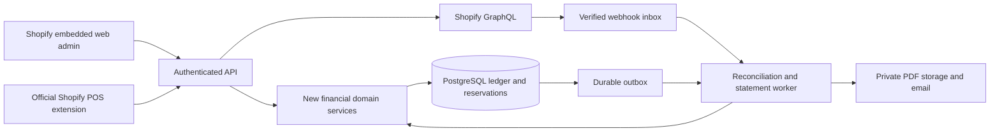

# New Shopify-native web application
## Product boundary and technology decision
This is a **greenfield product within Shopify**. Delphi executables, Genesis SQL Server, branch services and existing OnlineVersion APIs are never called by the new app. Their source is evidence for formulas and workflows only. Existing Genesis customers are not being migrated as part of this project.

Choose a TypeScript modular monolith: Next.js embedded administration UI, a Node.js/Fastify API, PostgreSQL 17, a separate worker using the same domain package, Redis for disposable caching/queue signalling, and private object storage for statement PDFs. Use decimal arithmetic in the domain package, never JavaScript floating-point money. This keeps Shopify extensions, API and admin in one language. Django/DRF remains a valid alternative, but the legacy-connected OnlineVersion backend is not a shortcut for this new product.

Version exact dependency releases and lockfiles during foundation work; run on a then-supported Node LTS. Containers: web, api, worker; managed database and Redis. Suggested initial hosting is a managed container provider such as Render; infrastructure choice must meet the selected launch geography's data requirements. No Supabase dependency is implied by the PostgreSQL design skill.

Repository layout (all under C:/Github/Shopify):
- apps/admin: Next.js with App Bridge and stable Polaris web components for embedded administration.
- apps/api: authentication, HTTP endpoints, Shopify GraphQL adapter, authorised application services.
- apps/worker: inbox processing, statement generation, reconciliation, delivery and outbox dispatch.
- extensions/trade-account: Shopify POS UI extension using the supported Preact/component toolchain.
- packages/domain: credit, posting, allocation, ageing, statement and later cash-office rules.
- packages/database: migrations, repositories, RLS and transaction boundaries.
- packages/contracts: validation and shared API types; currency amounts are decimal strings.
- tests: domain fixtures, database concurrency, Shopify contracts and end-to-end scenarios.

This is one public Shopify app with an embedded web dashboard and official Shopify POS extensions. The web dashboard is central to Phase 1. A standalone browser replacement checkout is not synonymous with “fully web application inside Shopify”; that particular extension of scope is policy-gated.

## Boundaries and system of record
| Concern | Authority |
|---|---|
| Product identities, variants, tax calculation, commerce orders, native payments/refunds and inventory | Shopify |
| Credit policies, approval reservations, debtor allocations, audit and operational AR ledger | This app |
| Accounting general ledger and statutory reporting | Merchant's accounting system; this app exports a reconciled subledger |
| Display balances/metafields/cache | Derived projections; never credit-authorisation authority |
| Historical formula expectations | Sanitised reference fixtures derived from Genesis source; never a live dependency |

The app creates receivables only for explicitly enrolled credit sales, not every unpaid Shopify order. Native payment terms and app AR must describe the same obligation; app payments cannot silently diverge from Shopify collection state.

## Request and data flow

Genesis source is deliberately outside the runtime diagram: it informs reviewed test fixtures during development.

## API surface
All routes are under /v1 and derive tenant from verified authentication. POST financial commands require Idempotency-Key, retained alongside a hash of the validated request; reusing a key with different content returns 409. Amounts are decimal strings with ISO currency. List routes use bounded cursor pagination.

| Route | Role | Contract |
|---|---|---|
| GET /accounts and GET /accounts/{id} | cashier or above | Account metadata, signed balance, eight buckets, unapplied credit, reservations and freshness |
| POST /accounts | bookkeeper/manager | Validated terms, currency, identity and policy; no caller-controlled tenant |
| PATCH /accounts/{id}/policy | manager | Version precondition, reason and audit; invalidate incompatible unused approvals |
| POST /accounts/{id}/credit-reservations | cashier | Basket digest and Shopify-validated total; approved reservation or structured policy rejection |
| POST /credit-reservations/{id}/override | supervisor | Authenticated supervisor, reason, exact digest/amount; no blanket authorisation |
| POST /credit-reservations/{id}/confirm | cashier | Start idempotent remote completion; return completed or pending operation ID |
| GET /operations/{id} | initiating actor or manager | Pending/completed/uncertain state; safe refresh after a timeout |
| POST /receipts | bookkeeper | Evidence-backed external receipt or existing successful Shopify transaction; selected native-sync mode |
| POST /allocations | bookkeeper | Credit/debit document IDs and amount; locked validation |
| POST /allocations/{id}/reverse | bookkeeper | Reason, effective date and immutable reversal |
| POST /statement-runs | bookkeeper | Date range, cutoff and preview/build request; no implicit send |
| POST /statement-runs/{id}/send | authorised bookkeeper | Reviewed recipients, delivery keys and explicit send authorisation |
| GET /reconciliation/exceptions | bookkeeper/manager | Native/app differences, ambiguous orders and actionable recovery state |

Return 401 for invalid authentication, 403 for role denial, 404 for inaccessible objects, 409 for stale version/idempotency conflict, and 422 for business-policy rejection. No raw SQL/API secrets in responses. Background commands return 202 plus operation ID.

## Additional trade requirements and release choices
| Requirement | Product treatment |
|---|---|
| Tax exemptions/reseller certificates | Shopify remains tax authority. Store jurisdiction/expiry/evidence in restricted storage; validate expiry and native exemption configuration before order creation. No universal tax engine in MVP. |
| Job-site delivery | Capture selected address and job reference as immutable order/document snapshots; Shopify fulfilment owns dispatch. Multi-drop routing is later scope. |
| Authorised buyers | Resolve customer plus company/location explicitly; record acting buyer and liability account. Do not allow an email match to grant credit access. |
| Physical signatures | Later proof-of-collection feature: capture only through supported device components, explicit consent and a hash-linked document artifact. Never treat a drawn signature as automatic legal enforceability. |
| Deposits/backorders | Credit exposure excludes only confirmed receipts; display stock/fulfilment state from Shopify. Deposit API/plan limits are capability-gated. |
| Returns and disputes | Link credit/refund to original invoice/tender, record reason and audit. Disputed balances remain owed unless separately adjusted; dispute/interest treatment requires an explicit policy. |
| Units/packs/quantity pricing | Preserve decimal quantities and unit conversion intent in fixtures; price grids and supported Shopify representation are Phase 2. |
| Offline/network failure | Browse/park drafts if supported; no new account approval using stale balances. Official POS extension offline behaviour is tested separately from browser PWA caching. |

## Accounting contracts
Amounts use NUMERIC(20,4) for posted values, NUMERIC(20,6) for quantities/unit calculations, and decimal-string JSON. Quantise to the transaction currency minor units at posting; retain calculation precision and explicit rounding adjustments. Phase 1: one base currency per shop/account, no foreign exchange. Shop currency changes block new posting until reviewed.

Signed account balance = posted receivable debits minus credits. Positive means customer owes the retailer. Journal examples:
- Credit invoice 115: DR receivables 115 / CR sales clearing 115.
- Receipt 100: DR cash/bank clearing 100 / CR receivables 100.
- Settlement discount 5: DR settlement discount 5 / CR receivables 5.
- Credit note 20: DR sales clearing 20 / CR receivables 20.
- Refund of customer credit 20: DR receivables 20 / CR refund clearing 20.
These are operational clearing accounts, not a duplicate tax/general ledger. Accounting export maps Shopify sale and app receipt once each; it must not export revenue again if Shopify already supplies it.

Journal post is atomic, balanced per currency, immutable and idempotent. Posted correction = reversal plus replacement. Allocation links credit documents to debit documents without changing net ledger balance. Every allocation checks same tenant/account/currency and remaining amount while locking the account and both documents. Reverse allocations through append-only reversal rows. Reallocating a paid invoice after a credit note is a deliberate operation with audit, not an incidental webhook side effect.

Remaining debit = original debit less active allocations. Unapplied credit = credit documents less active allocations. Net account balance = remaining debits minus unapplied credits, including dated adjustments. Default auto-allocation chooses oldest issued_on, then document_number, then id; a user can choose invoices explicitly. Compatibility bucket allocation must be a separate tested reporting strategy.

As-of reports filter both effective_date and recorded cutoff. Date-only filters do not reproduce statements after late backdated entries. Closed statements store their cutoff, policy version, item snapshot and PDF hash; corrections create a new generation. No statement job mutates allocations.

## Credit control and failure safety
Exposure = posted net account debt + reservations not yet represented by a posted invoice. Negative net credit offsets exposure in the initial policy. Available credit = limit - exposure. A reservation holds the full credit-funded amount inclusive of tax/shipping, less successfully collected deposit only. Never count a planned deposit as cash.

Lock debtor_account FOR UPDATE before checking status/limit and creating a reservation; payment, hold-change and approval paths use the same lock. Redis is not a money lock. At confirmation recheck identity, policy version, cart digest, currency, total and actor permission. Changed basket invalidates the old approval.

Lifecycle: reserved -> submitting -> consumed, with cancelled/expired for untouched reservations and uncertain for ambiguous remote outcomes. Expiry is 120 seconds before submission. Never expire submitting/uncertain commitments on a timer: fetch/reconcile the remote order first. Transition reservation to consumed in the same database transaction that posts its invoice, so exposure neither disappears nor doubles. Unknown order creation stays reserved and visible to operators.

Supervisor identity must be authenticated independently of an editable cashier field. Prefer supported staff/session authentication and server roles. If an app-managed PIN is required, hash it with an appropriate password hasher, rate-limit attempts, require supervisor selection and record the authenticated approval. Never interpret a stored Shopify staff ID alone as proof of authorisation. Overrides are single use, basket/amount bound, reason-required and expire after 120 seconds. Closed accounts never override. Hold versus over-limit permissions are separate.

When network, permissions or ledger freshness prevents safe checking, block app-created account sales; permit cash/card sales through the merchant's supported Shopify workflow. Do not promise the app can prevent all other Shopify admin/native/manual sale channels until bypass tests prove it. Out-of-channel sales update exposure and trigger exceptions; they cannot be prevented retrospectively.

## Embedded admin UX
Use App Bridge navigation and stable Polaris components: onboarding and scope status; Debtors; account detail (balance, eight buckets, open invoices, unallocated receipts, audit); allocation workbench; statement runs; reconciliation exceptions; settings/billing. Later add cash office and pricing. Each money action shows amount, currency, affected documents and result. Expose pending/uncertain operations rather than showing false success.

Onboarding: validate installation and plan capabilities -> select currency/timezone -> create terms and account -> map Shopify identities -> test an account order -> match first invoice -> preview statement. No Genesis installer, SQL credentials or database connection step.

Allocation screen: receipt amount; selected invoices; amount per invoice; remainder; deliberate confirm. Reject over-allocation server-side and report updated balances if another cashier posted simultaneously.

Statement run: preview date/cutoff and recipient list -> build PDFs -> review exceptions -> explicit Send. Scheduled sends require the merchant's saved schedule and recipient settings. Include business identity, account, opening balance, dated transactions, due dates, all eight buckets, unapplied credit, closing balance and remittance instructions. SMS sends a short-lived protected link, never account details. SMS is Phase 2.

## Official Shopify POS flow
Smart Grid tile -> selected/lookup customer -> debtor or company-location resolution -> live balance/ageing and pending exposure -> PO/job reference -> policy check -> supervisor if needed -> confirm account order -> receipt/order result.

Use actual supported targets and APIs verified in the Phase 0 spike. The label “Approve & charge to account” is aspirational until a supported order-completion path is proven. A UI tile does not itself create a payment tender.

Preferred proof: backend creates a properly priced native draft with buyer identity and terms, completes it as an unpaid account order, correlates it to the reservation, and clearly prevents duplicate native checkout of the same basket. Demonstrate inventory/location, taxes, receipt availability, cancelled carts, refunds and staff attribution on physical iOS and Android POS. If this is not supported acceptably, ship admin receivables plus read-only POS lookup with honest scope, or stop the POS launch. Do not substitute a fake paid custom tender.

## Cash-office expansion
For an app-owned register session: open float -> tender movements and drops -> blind denomination count -> submitted count -> manager reviews expected vs actual -> approval. Expected cash = opening float + cash sales + cash account receipts + paid-in - cash refunds - paid-out - cash drops. Account-credit sales are noncash. Card refunds reduce card tender, not cash. Closing float is a disposition of counted cash, not a second deduction from expected cash.

Do not send expected totals to cashier APIs before submission. Corrections append movements; submitted counts are immutable and recounts are new attempts. Reject movement-to-closed-shift races. Keep shop-local trading date separate from UTC timestamps, support midnight-crossing shifts. A $100 opening float + $200 cash sales - $30 cash refund - $150 drop gives expected $120; counted $115 yields -$5 shortage.

Shopify's complete native cash tracking/session API coverage has not been proven here. Until proved, sell only clearly scoped app-managed session controls with explicit manual reconciliation, never “automatic reconciliation of every Shopify tender.”

## Conditional browser counter design
Only after documented Shopify distribution classification and demand gate. This remains a Shopify-connected web surface, never a dependency on Delphi. A browser order-entry/quote interface may be a different approved use case from a replacement POS; classify the actual functions honestly.

Use Next.js PWA, keyboard wedge scanner, local IndexedDB catalogue and in-memory barcode index; scan-to-visible-line target p95 <100ms on a 50,000-variant reference device, warm lookup target <5ms. “Sub-millisecond” is not an end-to-end SLA. Ambiguous barcodes prompt selection.

Cache price/inventory for display; final order server-validates Shopify-calculated amounts and availability. Offline permits browsing/parked drafts only in initial release; no offline credit authorisation, tax finalisation or card capture. A later bounded offline design needs store-level credit escrow and replay semantics, not merely a retry queue.

Hardware: ordinary scanners act as keyboards; supported USB/serial/network printer models require a test matrix. WebSerial is HTTPS/permission dependent with limited browser availability; it is not a universal Windows printer driver. [MDN Web Serial](https://developer.mozilla.org/en-US/docs/Web/API/Web_Serial_API)
Prefer a supported signed print bridge or approved network-print SDK for reliable ESC/POS and drawer commands. Model-specific drawer pulse, paper/cutter status, duplicate-reprint labels and OS driver contention require lane tests. Card data stays in approved payment hardware/provider flows.

## Operations
TLS, private database, KMS/secret-manager token references, least-privilege service roles, actor audit, redacted logs, per-tenant budgets, signed PDF access and protected-customer-data approval. Never store card PAN/CVV. RLS plus composite foreign keys defend tenant isolation; pool connections use transaction-local tenant context.

Worker claims outbox rows using bounded leases and SKIP LOCKED; durable database rows survive Redis loss. Exponential backoff with jitter; retryable failure versus permanent user error classification; dead-letter view and safe replay. Initial targets: webhook durable-ack p95 <1s; AR display p95 <500ms at normal load; credit decision p95 <1s excluding Shopify order creation. Measure rather than advertise before pilot.

Nightly backups plus point-in-time recovery; proposed RPO <=15 minutes/RTO <=4 hours proven by restore drill. Track ledger imbalance (must be zero), webhook lag, uncertain orders, reconciliation drift, statement failures and cross-tenant access denials. Rollback application deployments without dropping financial data. Pause new credit when core integrity fails.

