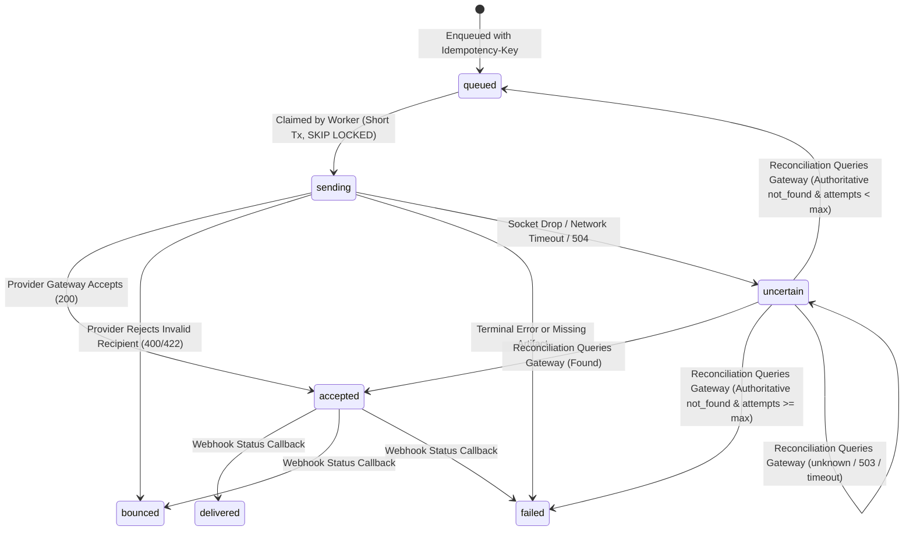

# Statement Delivery Gateway Contract & Recovery Proof

## 1. Overview & Objective

This document defines the delivery gateway contracts, retry semantics, and lease-based background recovery mechanisms for the **Genesis Trade Suite** statement engine. It provides formal evidence for **TASK-041** and establishes the failure-handling invariants required before connecting live email providers (such as SendGrid, Postmark, or AWS SES) in TASK-019.

---

## 2. Delivery State Machine

Statement delivery records in `statement_delivery` transition through strict lifecycle states:



---

## 3. Two-Phase Atomic Claim Architecture

To prevent database connection pool exhaustion and transaction deadlocks during external network calls:
1. **Phase 1: Short Atomic Claim Transaction**
   - The worker executes a short transaction with `FOR UPDATE OF d SKIP LOCKED` on `statement_delivery`.
   - Transitions claimed rows from `queued` to `sending`, increments `attempt_count`, updates `last_attempt_at = now()`, and **commits immediately**.
   - No external network or email API calls are ever made inside this database transaction.
2. **Phase 2: External HTTP Gateway Dispatch**
   - Outside the database transaction, the worker iterates over the claimed rows and posts payloads to the gateway.
   - Decrypts the recipient email from `recipient_secret_ref` (GDPR-compliant authenticated encryption).
   - Generates tenant-scoped, time-limited signed PDF download URLs.
3. **Phase 3: Status Recording**
   - Updates the delivery record to `accepted`, `bounced`, `failed`, or `uncertain`.
   - If the worker process terminates abruptly during Phase 2, the delivery remains in `status = 'sending'` with its timestamp recorded.

---

## 4. Authoritative `not_found` versus `unknown`

A critical requirement of financial statement delivery is **zero duplicate emails**. When an in-flight delivery outcome is uncertain, the system enforces a strict distinction between an authoritative `not_found` and an ambiguous `unknown`:

| Outcome | Gateway Response | Interpretation | Recovery Action |
|---|---|---|---|
| **Authoritative `not_found`** | HTTP 404 / `{ status: "not_found", authoritative: true }` | The remote gateway definitively confirms that no message was ever received or logged for this `(tenantId, idempotencyKey)` tuple. | If `attempt_count < maxAttempts`, reset to `queued` for a single safe resend. If attempts exhausted, mark `failed`. |
| **`unknown`** | HTTP 503 / 502 / 504 / timeout / `{ status: "unknown" }` | The gateway is temporarily unreachable, status indexing is delayed, or the transport failed. The remote state cannot be definitively proven. | **NEVER authorise retry.** Leave in `uncertain`, update `last_attempt_at = now()`. The delivery is NEVER requeued or double-sent. |
| **`accepted` / `delivered`** | HTTP 200 `{ status: "accepted", messageId }` | The remote gateway previously received and accepted the message. | Update local database to `accepted` / `delivered` with `provider_message_id`. **Zero resend.** |

> [!IMPORTANT]
> **Core Acceptance Invariant:** `unknown` never authorises retry. An ambiguous or failed gateway status inquiry must never trigger a second send.

---

## 5. Tenant-Scoped Idempotency & Composite Keys

All delivery dispatches and status inquiries are strictly scoped by `(tenant_id, idempotency_key)`:
- Payloads and HTTP query strings always transmit both `tenantId` and `idempotencyKey`.
- Providers store messages under composite keys `${tenantId}:${idempotencyKey}`.
- Tenant A using key `idem-1` and Tenant B using key `idem-1` will never collide, share logs, or resolve each other's messages.
- The `statement_delivery` table enforces `UNIQUE (tenant_id, idempotency_key)` at the PostgreSQL schema level.

---

## 6. Multiple Billing Contacts Resolution

When an account has multiple billing contacts with `send_statements = true`:
- A naive SQL join (`LEFT JOIN billing_contact bc`) would create a Cartesian product, multiplying `statement_delivery` rows and causing duplicate email dispatches.
- Genesis Trade Suite enforces a scalar subquery in delivery claim SQL:
  ```sql
  (
    SELECT bc.email
    FROM billing_contact bc
    WHERE bc.tenant_id = d.tenant_id
      AND bc.debtor_account_id = a.id
      AND bc.send_statements = true
      AND bc.email IS NOT NULL
    ORDER BY bc.created_at ASC
    LIMIT 1
  ) as billing_contact_email
  ```
- Each statement delivery row represents an isolated recipient with its own encrypted `recipient_secret_ref`.
- When multiple contacts are enqueued, each contact receives an isolated `statement_delivery` row with a distinct idempotency key, guaranteeing **exactly one email per recipient**.

---

## 7. Leases & Bounded Timeouts

- **Bounded Status Query Timeouts:** All remote status lookups use an `AbortController` bounded to **5,000ms** (5s). If a remote gateway hangs, the lookup aborts and returns `{ status: "unknown" }`.
- **Worker Job Leases:** Background worker jobs declare a `leaseExpiresAt` timestamp.
  - If a job lease expires before execution, `BackgroundWorker.tick` skips the job to allow healthy workers to re-claim.
  - Handlers execute with guaranteed isolation.
- **Stale Sending Lease Window:** During reconciliation, `reconcileUncertainDeliveries` enforces `staleSendingThresholdMs` (default 30,000ms – 60,000ms). Active in-flight slow batches within their lease window are ignored by reconciliation, preventing concurrent duplicate sends.

---

## 8. Test Gateway Verification Matrix

Automated verification in [`tests/integration/statement-delivery.test.ts`](file:///C:/Github/Shopify/tests/integration/statement-delivery.test.ts) uses a local HTTP gateway (`TestDeliveryGateway`) listening on `127.0.0.1`:

| Test Case | Injected Fault | Expected Behavior | Gateway Acceptances | Result |
|---|---|---|---|---|
| **Crash-Before-Send** | Worker crashes after claim; gateway never reached | Gateway returns 404 `not_found` -> Requeued -> Dispatched cleanly | **Exactly 1** | **PASS** |
| **Crash-After-Send** | Gateway logs message, then drops socket (lost response) | Worker marks `uncertain` -> Reconcile queries gateway -> Gateway confirms `accepted` -> DB updated without resend | **Exactly 1** | **PASS** |
| **Unavailable Lookup (503)** | Gateway status returns HTTP 503 | Reconcile records `stillUncertain` -> Never requeued -> Worker pass skips | **0 (or 1 if originally sent)** | **PASS** |
| **Explicit Unknown Status** | Gateway returns `{ status: "unknown" }` | Reconcile records `stillUncertain` -> Never requeued -> No blind resend | **0 (or 1 if originally sent)** | **PASS** |
| **Delayed Visibility** | Gateway receives message; status query returns `unknown` for 50ms | Immediate reconcile leaves `uncertain` -> After 60ms delay, reconcile resolves `accepted` -> Zero resends | **Exactly 1** | **PASS** |
| **Multiple Billing Contacts** | 3 billing contacts configured | Scalar subquery avoids row duplication -> 2 distinct contact deliveries dispatched | **Exactly 1 per contact** | **PASS** |
| **Active Slow Batch** | Gateway artificial delay (25ms) | In-flight batch marked `sending` -> Concurrent worker and reconcile passes skip in-flight batch | **Exactly 1 per delivery** (6 total) | **PASS** |
| **Worker Job Leases** | Expired lease (`leaseExpiresAt < now`) | Expired job skipped by `worker.tick`; valid lease executes dispatch | **Exactly 1** | **PASS** |

---

## 9. Staging & Live Provider Gate Requirements

Before enabling live transactional email providers in production:
1. Provider must support idempotent submission (via header or request body).
2. Provider must support authoritative status inquiries by ID or idempotency key.
3. Webhook endpoints must verify HMAC signatures and reject unauthenticated payloads.
4. Secrets must be managed via secret store (`secrets://...`).
